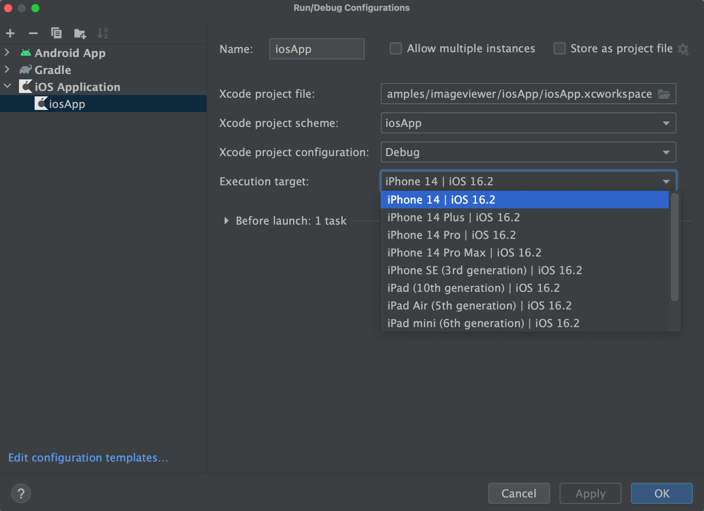

# Wingman

Wingman utilizing Jetpack [Compose Multiplatform](https://github.com/JetBrains/compose-multiplatform-ios-android-template) for iOS and Android,
Using Tinder & OpenAI APIs to AI-power conversation starters, helping you break the ice and engage with potential matches effortlessly. 
Enhance your dating experience with Wingman!

Follow our steps below to get the app up and running.

## Set up the environment

> **Warning**
> You need a Mac with macOS to write and run iOS-specific code on simulated or real devices.
> This is an Apple requirement.

To work with Wingman, you need the following:

* A machine running a recent version of macOS
* [Xcode](https://apps.apple.com/us/app/xcode/id497799835)
* [Android Studio](https://developer.android.com/studio)
* [Kotlin Multiplatform Mobile plugin](https://plugins.jetbrains.com/plugin/14936-kotlin-multiplatform-mobile)
* [CocoaPods dependency manager](https://kotlinlang.org/docs/native-cocoapods.html)

### Check your environment

Before you start, use the [KDoctor](https://github.com/Kotlin/kdoctor) tool to ensure that your development environment is configured correctly:

1. Install KDoctor with [Homebrew](https://brew.sh/):

    ```text
    brew install kdoctor
    ```

2. Run KDoctor in your terminal:

    ```text
    kdoctor
    ```

   If everything is set up correctly, you'll see a valid output:

   ```text
   Environment diagnose (to see all details, use -v option):
   [✓] Operation System
   [✓] Java
   [✓] Android Studio
   [✓] Xcode
   [✓] Cocoapods
   
   Conclusion:
     ✓ Your system is ready for Kotlin Multiplatform Mobile Development!
   ```

   Otherwise, KDoctor will highlight which parts of your setup still need configuration and suggest how to fix them.

## Examine the project structure

Open the project in Android Studio and switch the view from **Android** to **Project** to see all the files and targets belonging to the project:


Your Compose Multiplatform project includes three modules:

### shared

This is a Kotlin module that contains the logic common for both Android and iOS 


### androidApp

This is a Kotlin module that builds into an Android application. 

### iosApp

This is an Xcode project that builds into an iOS application.

## Run your application

### On Android

To run your application on an Android emulator:

1. Ensure you have an Android virtual device available. Otherwise, [create one](https://developer.android.com/studio/run/managing-avds#createavd).
2. In the list of run configurations, select `androidApp`.
3. Choose your virtual device and click **Run**:

### On iOS

#### Running on a simulator

To run your application on an iOS simulator in Android Studio, modify the `iosApp` run configuration:

1. In the list of run configurations, select **Edit Configurations**:

   

2. Navigate to **iOS Application** | **iosApp**.
3. In the **Execution target** list, select your target device. Click **OK**:

   

4. The `iosApp` run configuration is now available. Click **Run** next to your virtual device:

#### Running on a real ios device

run your Compose Multiplatform application on a real iOS device
To do so, you'll need the following:

* `TEAM_ID` associated with your [Apple ID](https://support.apple.com/en-us/HT204316)
* The iOS device registered in Xcode

##### Finding your Team ID

In the terminal, run `kdoctor --team-ids` to find your Team ID.
KDoctor will list all Team IDs currently configured on your system, for example:

```text
3ABC246XYZ (Max Sample)
ZABCW6SXYZ (SampleTech Inc.)
```

<details>
<summary>Alternative way of finding your Team ID</summary>

If KDoctor doesn't work for you, try this alternative method:

1. In Android Studio, run the `iosApp` configuration with the selected real device. The build should fail.
2. Go to Xcode and select **Open a project or file**.
3. Navigate to the `iosApp/iosApp.xcworkspace` file of your project.
4. In the left menu, select `iosApp`.
5. Navigate to **Signing & Capabilities**.
6. In the **Team** list, select your personal team.

   If you haven't set up your team yet, use the **Add account** option and follow the steps.

</details>

To run the application, set the `TEAM_ID`:

1. In the project, navigate to the `iosApp/Configuration/Config.xcconfig` file.
2. Set your `TEAM_ID`.
3. Re-open the project in Android Studio. It should show the registered iOS device in the `iosApp` run configuration.

## How to configure the iOS application

To get a better understanding of this project's setup and learn how to configure the basic properties of iOS app without Xcode,
open the `iosApp/Configuration/Config.xcconfig` file in Android Studio. The configuration file contains:

* `APP_NAME`, a target executable and an application bundle name
* `BUNDLE_ID` that [uniquely identifies the app throughout the system](https://developer.apple.com/documentation/bundleresources/information_property_list/cfbundleidentifier#discussion)
* `TEAM_ID`, [a unique identifier generated by Apple that's assigned to your team](https://developer.apple.com/help/account/manage-your-team/locate-your-team-id/#:~:text=A%20Team%20ID%20is%20a,developer%20in%20App%20Store%20Connect)

To configure the `APP_NAME` option, open `Config.xcconfig` in any text editor *before opening* the project in Android Studio and set the desired name.

If you need to change this option after you open the project in Android Studio, do the following:

1. Close the project in Android Studio.
2. Run `./cleanup.sh` in your terminal.
3. Change the setting.
4. Open the project in Android Studio again.

To configure advanced settings, use Xcode. After opening the project in Android Studio,
go to Xcode and open the `iosApp/iosApp.xcworkspace` file, and make changes.

